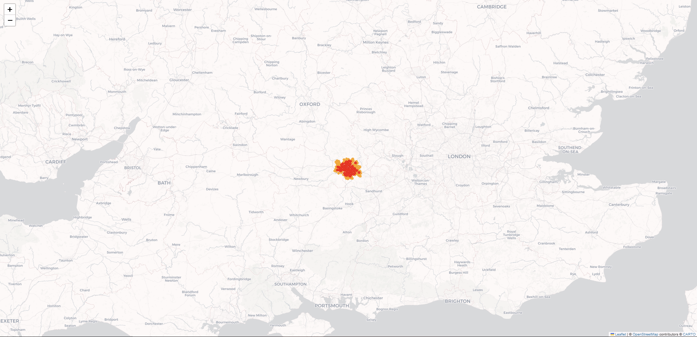

# Insights from Failed Orders (Gett Take‑Home Assignment)

This project investigates **failed taxi orders** on the Gett platform to uncover reasons for failure, identify temporal and geographic patterns, and draw actionable insights for improving the order‑driver matching process.

---

# The Questions

These are the main questions explored in this project:

1. **What are the main reasons for failed orders?**  (Cancellations before/after driver assignment, system rejections)
2. **How are failed orders distributed by hour of the day?**  Are there peak failure hours? Why?
3. **How long does it take for customers to cancel?**  How does this differ with and without a driver assigned?
4. **How does average ETA vary by hour?**  What patterns emerge?
5. **(Bonus)** Using H3 and Folium, *how many size 8 hexagons contain 80% of all orders*, and what does the spatial distribution of fails look like?

---

# Tools I Used

For my deep dive into the failed order patterns, I used the following tools:

* **Python:** Core tool for analysis and modeling.

  * **Pandas:** For data preparation, filtering, and aggregation.
  * **Matplotlib & Seaborn:** For clear and effective data visualizations.
  * **Folium & H3:** For geospatial analysis and interactive maps.
  * **Shapely:** For working with polygon boundaries.
* **Jupyter Notebooks:** For interactive exploration and combining notes with code.
* **VS Code:** For modularizing analysis code.
* **Git & GitHub:** For version control and publishing this project.

---

# Data Preparation and Cleanup

The datasets provided were:

* **data\_orders.csv** → order‑level info (datetime, location, ETA, status, cancellation time, driver assignment).
* **data\_offers.csv** → order‑offer mapping.

## Import & Clean Data

```python
import pandas as pd

orders = pd.read_csv("data_orders.csv", parse_dates=["order_datetime"])
offers = pd.read_csv("data_offers.csv")

# Map status codes
status_map = {4: "Client_cancelled", 9: "System_reject"}
orders["order_status"] = orders["order_status_key"].map(status_map)

# Extract useful features
orders["hour"] = orders["order_datetime"].dt.hour
orders["cancel_minutes"] = orders["cancellation_time_in_seconds"] / 60
```

## Data Cleaning

* Removed invalid/missing coordinates.
* Dropped negative/zero ETAs.
* Ensured unique `order_gk` in orders dataset.
* Trimmed extreme outliers in cancellation times using IQR.

---

# The Analysis

## 1. Reasons for Failed Orders

I grouped failed orders by **status** and **driver assignment**.

```python
failed = orders[orders["order_status_key"].isin([4,9])]
failed.groupby(["driver_assigned_key", "order_status"]).size()
```

### Results

* Client cancellations (especially **without a driver assigned**) dominate failures.
* System rejections also form a large portion, especially during peak demand.

---

## 2. Failed Orders by Hour

```python
failed.groupby("hour").size().plot(kind="bar")
```

### Results

* Failure counts are highest during **morning commute (7–9 AM)** and **evening peak (5–8 PM)**.
* System rejections spike during high‑demand hours, suggesting supply shortages.

---

## 3. Average Time to Cancellation

I compared **with vs without driver assigned**:

```python
failed.groupby(["hour","is_driver_assigned_key"]).cancel_minutes.mean()
```

### Results

* **Without driver:** Customers cancel quickly (within a few minutes).
* **With driver:** Cancellations occur later, suggesting customers wait longer before cancelling.

---

## 4. Average ETA by Hour

```python
orders.groupby("hour").m_order_eta.mean().plot(kind="line")
```

### Results

* ETAs spike during **rush hours**, aligning with higher failure rates.
* Longer ETAs are strongly correlated with more cancellations.

---

## 5. BONUS: Spatial Analysis with H3 + Folium

Using **H3 (res=8)**, I identified which hexagons cover 80% of orders and visualized them on a Folium map.

```python
import h3, folium

orders["hex_id"] = orders.apply(lambda r: h3.latlng_to_cell(r.origin_latitude, r.origin_longitude, 8), axis=1)
hex_counts = orders.hex_id.value_counts().cumsum()
```

### Results

* Only a **small number of hexes** contain 80% of orders → demand is geographically concentrated.
* These hot zones also show the **highest fail counts**, meaning operational improvements should focus there.



---

# What I Learned

* **Data Wrangling:** Cleaned real‑world operational data with missing values and anomalies.
* **Geospatial Analysis:** Learned to combine H3 indexing with Folium mapping.
* **Pattern Discovery:** Identified strong links between **ETA, demand peaks, and order failures**.
* **Business Insight:** Concentrated demand zones and supply shortages drive most failures.

---

# Insights

* **Cancellations dominate failures**, especially when no driver is assigned.
* **Peak traffic hours** are also **peak failure hours**.
* **High ETAs** are a leading indicator of order failure.
* A small number of geographic zones account for most demand and failures.

---

# Challenges I Faced

* Handling inconsistent cancellation times (outliers).
* Balancing hourly patterns vs absolute counts for fair comparison.
* Getting Folium maps to display properly in Jupyter/GitHub.
* Correcting H3 cell boundary plotting errors.

---

# Conclusion

This project provided actionable insights into Gett’s failed orders. By addressing supply shortages in high‑demand zones and focusing on reducing ETAs during peak hours, the platform can significantly improve fulfillment rates.

---

# Next Steps

* Enrich analysis with **driver supply data**.
* Add **day‑of‑week patterns**.
* Explore **predictive modeling** of order failure risk.
* Build **dashboard version** for BI stakeholders.

---
